# LKS 3DCoat Tools

A cModule for [3DCoat](https://3dcoat.com/) by Liam avec copilot

## Features
### Customizable Radial Tree Menu


- Similar to Blender's pie menus and Maya's Marking menus, but in 3DCoat
- Make your own in the editor

## Batch Tools

- These batch tools are meant to work consistently across your 3DC scene where 3DC don't, or wrap modals in static ui so that you can perform operations in one-click instead of configuring popups. 
- A whole lotta batch tools, leveraging a custom iterator that attempts to bypass instances so you don't get double-ops. 
- Scopes selected / subtree / all make it much easier to manage your scene

#### Match Density Decimate
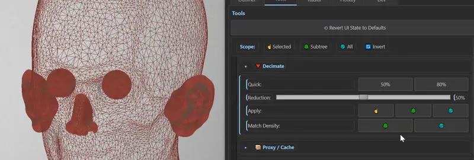
- From a reference mesh, the tool will try to decimate or subdivide either the subtree or everything in the scene to match the source object's polygon density. Good for mass optimizing your 3dcoat scenes before export

#### Ghost / Visibility Batchers
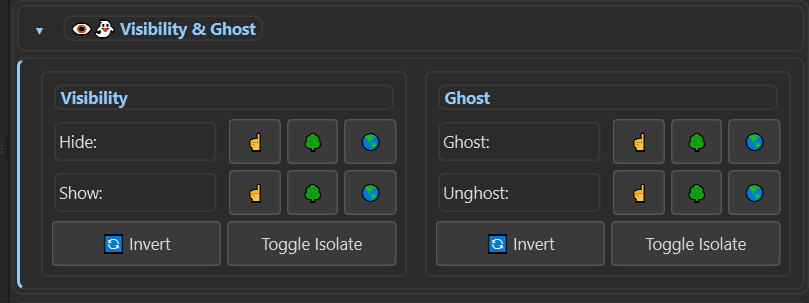
- 3DCoat's ghost / visibility have always been a pain because often the builtin invert / show call do not consistently edit the visibility, resulting in having to manually click the ghost / visibility button on every object in the scene tree. This is a workaround for that that actually works.
#### Material ID Fills
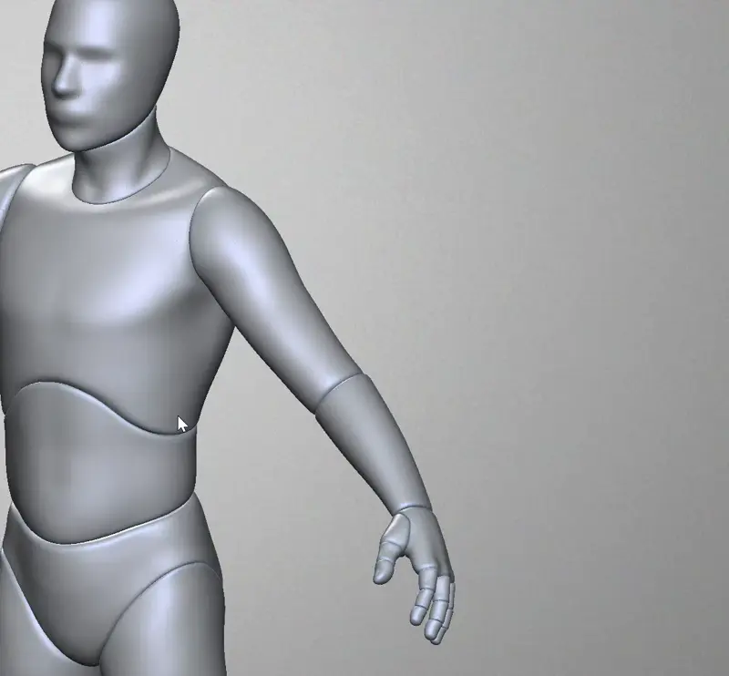
- Fills each object with a random color on a named ID layer. Good for baking based on mat IDs!

#### Safe Symmetrize
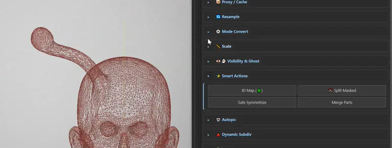
- 3DCoat's mesh-mode symmetrize crashes half the time. Safe Symmetrize will work in voxel or surface mode. 
	- If in voxel mode, simply invokes symmetrize
	- If in surface mode, voxelizes before applying symmetry, trying to preserve detail, and then decimate back down to your original polycount.
	- This way you can use the same shortcut without having to think about whether you are in surface mode or voxel mode.

#### Split Masked / Hidden
- This tool is meant to take a many-click operation in 3dcoat and merge it into one. 
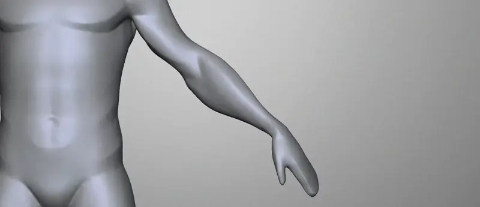
- In `surface mode`, it will split off your masked area to a new sculpt object and fill the holes made with one button press.

- In `voxel mode`, it will split any hidden areas to a new sculpt object and **remove the hidden part from the original layer!** Default 3DCoat split hidden will make a new vox layer from your hidden part, but it still leaves the split part hidden in the original sculpt object. This is not typically what you want, you just want to hide a part and split it off.
- This tool handles both cases with one button press. Simplifies the UX.

#### Dynamic Subdiv Brush Globals
- Do you hate always having to change your dynamic subdiv settings every time you change a brush? Try mapping the Dynamic Subdiv increment / decrement to a shortcut (I like pg up / pg down). This tool caches the dynamic subdiv level you are currently at to disk, so you can change brushes and get back to your sculpting with a keypress instead of having to reconfigure your brush

#### WIP: One click autopo -> multires
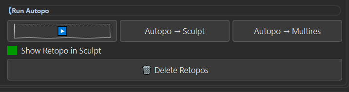
- Basically already works but you have to click through menus. Trying to get 3DCoat autopo to act more like zremesher where you modify some settings and click the "go" button again instead of clicking through popup menus. I've exposed the autopo config entirely
- Intention again is to stay in sculpt mode. 
- `>` will just produce a new autopo with configured settings and return to sculpt mode.
- `Autopo -> sculpt` will make a new autopo mesh and bring it into sculpt mode as a new sculpt object. 
- `Autopo -> Multires` will generate the autopo and bring it in as the lowest subdivision for the current sculpt object
### Action Commands -> Shortcut MenuItems
- Many of the above have script menu items that can be bound to a shortcut. Try registering them (installation below) and binding some
- Will probably make an action script generator (so you can generate your own invoker scripts to bind) in the future
## Hotkey editor and Conflict Resolve tool
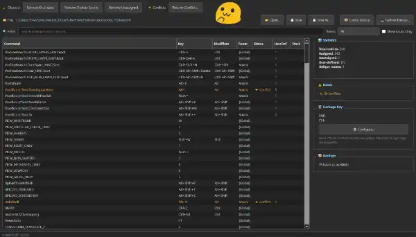
- If you are like me and have been using 3DC for years, your shortcuts xml is probably a hot mess. I've used this tool on my own xml to clean up the xml and it works around all the 3dcoat weirdness by some pain staking manual keycode verification I did. As it turns out, 3dcoat actually requires invalid xml for its prefs. If you just download any old python xml validator, it will make it not loadable by 3dcoat, which will then proceed to dump your entire shortcuts and start over.
### IF YOU USE THE HOTKEY EDITOR, BACK IT UP WITH THE BACKUP TOOL BEFORE AND AFTER CHANGES
- it is VERY LIKELY you will break your hotkeys file. Less likely with all the code that tries to safe-ify it, but it's impossible to be 100% certain. 

- If you make rooms and then deprecate them, they remain in your hotkeys xml. This tool allow you to bulk edit hotkey rooms or remove shortcuts from orphan rooms
- 3DCoat does not also clean up **perfect duplicates** or **null-key bindings**. Because of this, cruft accumulates. This tool can delete exact duplicates and null key bindings for you automatically. 
- What is the trash-key? 3DCoat does not allow unbinding some shortcuts. It will regenerate them any time you delete the binding, putting them on keys you don't want. The "trash key" is my workaround for this. Since I can't delete the bindings without them being regenerated. I instead bind to a single key I use as a throwaway. Hence, trash key. Any 3DCoat default shortcuts you do not want, but can't get rid of, bind to a trash key.
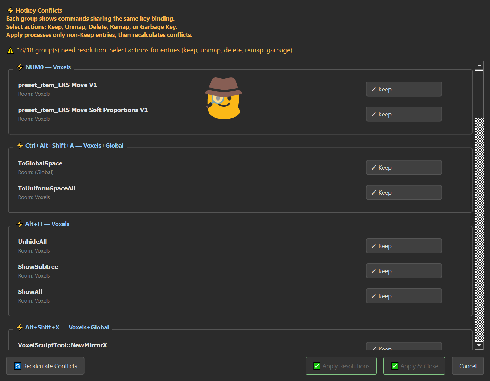
- The hotkey resolver will detect if two or more shortcuts are used in the same room at the same time. If so, it identifies them as a conflict.
- You can resolve conflicts by deleting, trash-keying, or rebinding all except one shortcut in a conflict group.


---

## Installation


### Download

**[Download Latest Release](https://github.com/LiamSmyth/LKS_3DCTools/releases/latest)** (LKS_3DCoat_cModule_vX.X.X.zip)

### Base Installation Steps

1. **Download** the latest `LKS_3DCoat_cModule_vX.X.X.zip`

2. **Extract** the `LKS/` folder to your 3DCoat cModules directory:
   ```
   Documents/3DCoat/UserPrefs/StdScripts/cModules/LKS/
   ```

3. Extension should show up in the extension menu. (Can get to it with `windows -> panels -> extensions` in 3DC)
4. 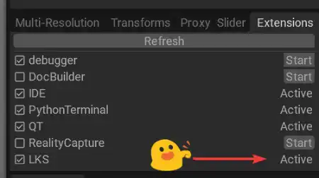
5. Click start to launch. Click `always on top` if you want it to be pinned to screen.
   
6. Navigate to Tools tab for basic use
   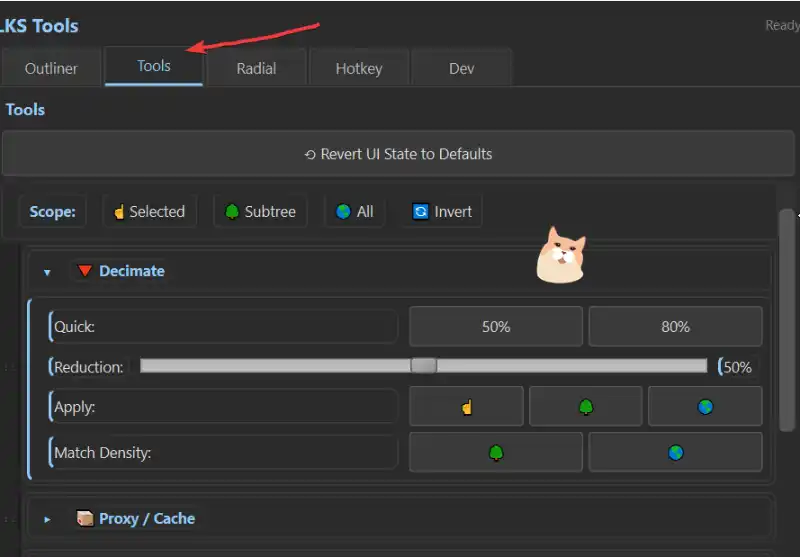

### Install Menu Items to enable Hotkeys
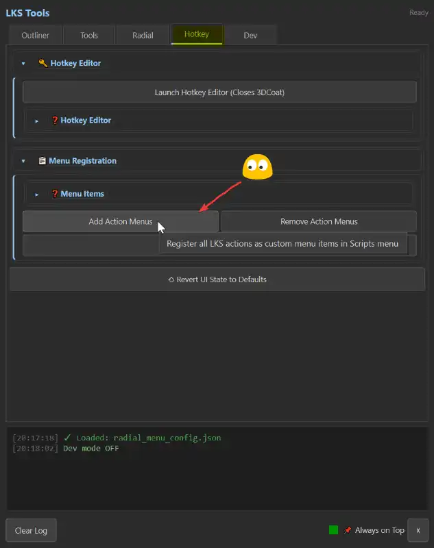
- 3Dcoat requires shortcut items be mapped to a menu item hotkey in order to be invoked.
- As a consequence, the easiest way I found to map custom scripts is to register actions to the scripts menu with custom menu items.
- If you navigate to Hotkey tab -> Menu Registration -> Add Action Menus, you will get a substantial list of keyable scripts added to your scripts menu. 
- Must restart 3DCoat for them to show up / be removed.
- Once they are added, open scripts menu and use typical END shortcut mapping to map custom scripts to hotkeys.
- Uninstall with "Remove Action Menus". At present there is no partial installs, sorry!

### Install Radial Menu to Hotkey
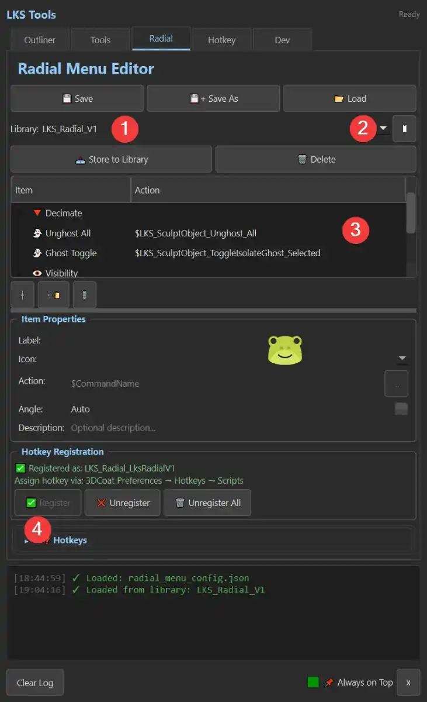
- Go to radial menu tab
- If you installed the menu items for hotkeys, you should be able to use LKS_Radial_V1 radial menu for starters. 
- Click the dropdown "Library" to select a radial preset. You can also build one from scratch. 
	- Radial menu definitions are simple json files. You can save / load them from disk, or store them to the addons folder library with store. Delete will remove the currently edited one.
- With a library item selected, hit the white square button at right to load the preset. With the preset loaded, you can Register the radial menu. Registering will add a radial menu item to your scripts menu. As usual, when changing menu items, you will need to restart 3DCoat for them to show up.
- This generally should be invoked with a shortcut key. Use 3DCoat's `END` shortcut mapping to map the radial menu to a key.

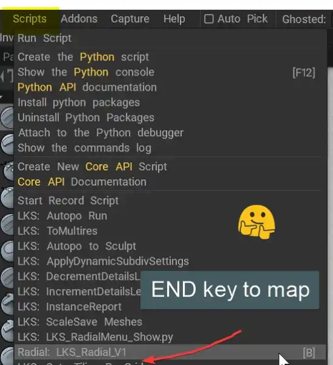

- When the radial menu is bound, hold the key down, and release over an item to invoke it. Releasing over empty space will close the radial menu without doing anything.
- Some items in the radial menus are "Branch Nodes": they allow you to spawn sub-radials, which contain their own actions. A bit like a hybrid of blender and maya. 

### Editing or making your own radial menus
- The panel with "items" and "actions" is a radial menu editor.
- Use the three buttons below the editor box to add a radial menu item, add a child item, or remove an item.
- Parent items with no commands, and children, will be considered Branch Nodes. These unfold to reveal their children when moused over
- Hover over a node with a 3DCoat ui.cmd action like `$CleanSurface` mapped to it, and release the radial menu key to execute the action.
- To find your own actions from the 3DCoat ui, you can use `MMB+RMB` on any 3DC ui element. This will copy the ui command to your clipboard, and you can paste it into the Action field.
- When you are done editing, use Store to Library and save as a new item, or over an existing one.
	- Over an existing one will update the item, your shortcuts should remain intact
	- A new one will be stored to the library, but is not registered until you register it. This process may be a bit jank. I recommend storing it, loading it from the list with edit button, then clicking store just to be safe, until I lock it down a bit more.
- **You can make and register as many radial menus as you like!**

---

---

## 📄 License

I am not sure how licensing works because I'm not a proper programmer, but feel free to use / edit / branch this.
You may use it for any artmaking purpose for free, professional or personal. 
It is virtually all claude code, so whatever restrictions that comes with OOTB